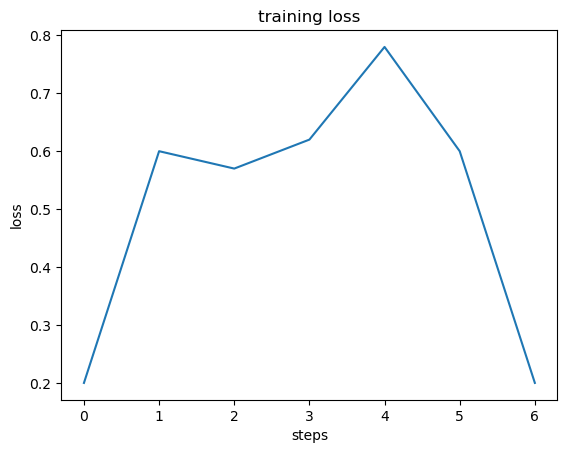

# fastspeech

<!-- WARNING: THIS FILE WAS AUTOGENERATED! DO NOT EDIT! -->

## Install

``` sh
pip install fastspeech
```

## How to use

``` python
model = FastSpeech(vocab_sz, ni, n_bins, fft_config, 4, 
                   fft_config, 4, dp_config)

with torch.no_grad():
    mels = model(vec, durations)[0]
    
show_mel(mels[0])
```


