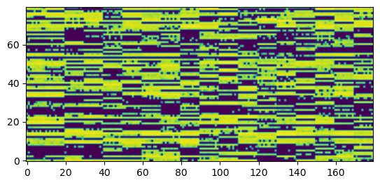

# fastspeech

<!-- WARNING: THIS FILE WAS AUTOGENERATED! DO NOT EDIT! -->

## Install

``` sh
pip install fastspeech
```

## How to use

``` python
loss = [0.2, 0.6, 0.57, 0.62, 0.78, 0.60, 0.2]
plot_loss(loss)
```


