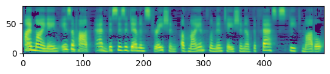

# fastspeech

<!-- WARNING: THIS FILE WAS AUTOGENERATED! DO NOT EDIT! -->

## Install

``` sh
pip install -e '.[dev]'
```

## How to use

The first step to use the model for inference is to import the model
from a trained checkpoint

``` python
model, norm = load_model_inference(checkpoint_path)
```

Next we need to process the text to convert it into something the model
can recognize

``` python
text = "Hi, my name is ahod and this is a demonstration of my implementation of the fast speech model"
phones = preprocess_text(text, vocab_path)
```

Then we generate the melspectrogram using the FastSpeech model

``` python
mel = bayesian_inference(phones, model, 10)
mel = norm.denormalize(mel)
show_mel(mel)
```



Lastly we use a vocoder to convert the melspectrogram to a wav file. In
this case we are using the Griffin-Lim Algorithm to perform the inverse
operation

``` python
sf.write(save_path, wav, sr)
```

<audio src="https://github.com/ahadjawaid/fastspeech/blob/main/sample_data/demonstration.wav?raw=true" controls>
Your browser does not support the audio element.
</audio>
